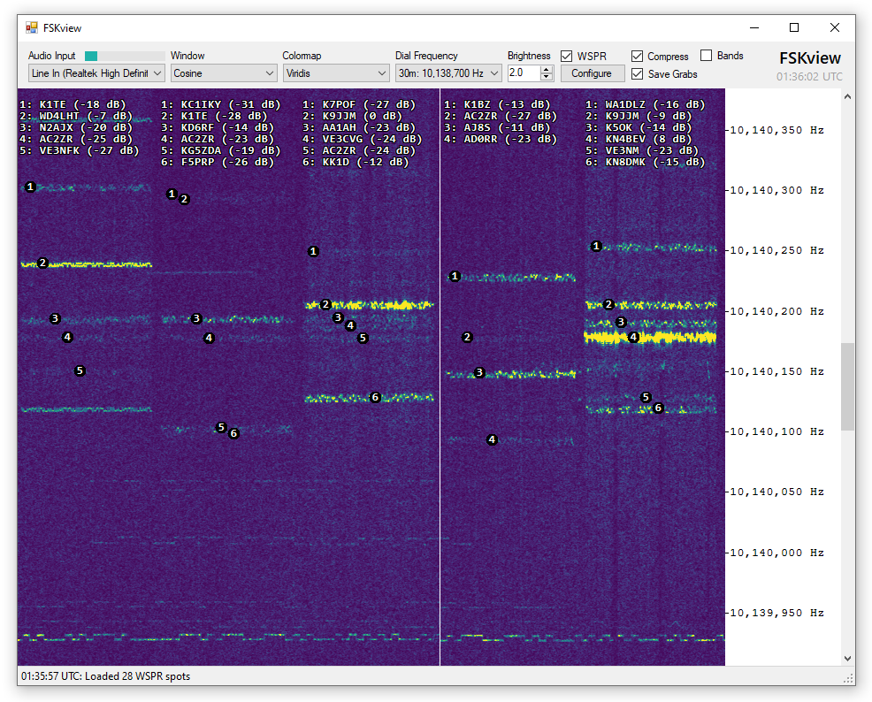
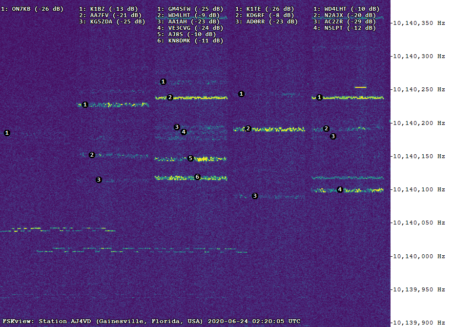
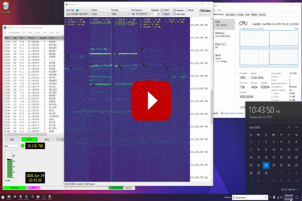
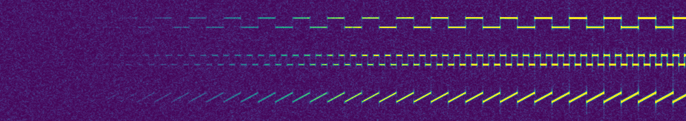

# FSKview
**FSKview is a high-resolution spectrogram for viewing narrowband frequency-shift keyed (FSK) signals in real time.** FSKview can be used as a [QRSS](#QRSS) viewer, and if [WSTJ-X](https://physics.princeton.edu/pulsar/K1JT/wsjtx.html) is running FSKview can label [WSPR](doc/wspr.md) spots directly on the spectrogram in real time.

### Download

> **⚠️ WARNING:** FSKview is early in development and a click-to-run program is not yet provided.

### QRSS Grabber

FSKview can serve as a QRSS grabber, saving the latest grab every 10 minutes. Output images are stamped with the time and date as well as station information.

This video shows my system listening to the 30m WSPR band over a 24 hour period. I don't have a great antenna, but it gets the job done well enough to communicate how this software works.

### Development Notes

Signal analysis is performed by the [FftSharp](https://github.com/swharden/FftSharp) and [Spectrogram](https://github.com/swharden/Spectrogram) libraries and the sound card interface is provided by [NAudio](https://github.com/naudio/NAudio).

Notes and experiments are in [/dev](dev)

## Resources

### What is QRSS?

QRSS is a type of continuous wave (CW) radio signal which uses frequency-shift keying (FSK). QRSS is ultra-narrowband (5Hz bandwidth) and ultra slow speed (about 3 letters per minute). The abbreviation QRSS is [Morse code slang](https://en.wikipedia.org/wiki/Q_code) for "transmit a lot slower".

### Notes
* [Encoding and Decoding WSPR Messages](doc/wspr.md)

### Links
* [WSPR](https://en.wikipedia.org/wiki/WSPR_(amateur_radio_software)) on Wikipedia
* [K1JT Program](http://physics.princeton.edu/pulsar/K1JT/devel.html)
* [Grid square lookup](http://www.levinecentral.com/ham/grid_square.php?Grid=FN20)
* [WSJT](https://sourceforge.net/projects/wsjt/) on SourceForge
* [WSPR Mode in WSJT-X](https://wsprnet.org/drupal/node/5563)

### Introduction to QRSS
  * [What is QRSS?](https://www.qsl.net/m0ayf/What-is-QRSS.html)
  * [QRSS and you](http://www.ka7oei.com/qrss1.html)
  * [QRSS (slow CW)](https://sites.google.com/site/qrssinfo/QRSS-Slow-CW)

### Technical Pages
  * [Simulation of QRSS Signals](https://www.qsl.net/pa2ohh/12qrsssim1.htm)

### Other QRSS Software

* Argo ([website](http://digilander.libero.it/i2phd/argo/)) - closed-source QRSS viewer for Windows
* SpectrumLab ([website](http://www.qsl.net/dl4yhf/spectra1.html)) - closed-source spectrum analyzer for Windows 
* QrssPIG ([gitlab](https://gitlab.com/hb9fxx/qrsspig)) - open-source spectrograph for Raspberry Pi (C++)
* Lopora ([website](http://www.qsl.net/pa2ohh/11lop.htm)) - open-source spectrograph (Python 3) 
* QRSS VD ([github](https://github.com/swharden/QRSS-VD)) - open source spectrograph (Python 2)

### QRSS Hardware
This repository is exclusively devoted to software. I run a separate repository dedicated to theory, design, construction, and testing of QRSS transmission and reception hardware: https://github.com/swharden/QRSS-hardware
