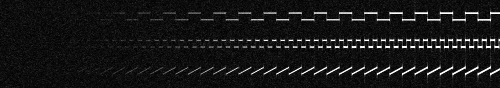
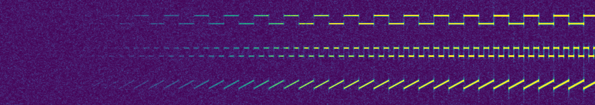

## Goals
* multi-threaded FFT analysis
* sensitivity adjustment
* easily put scales on spectrograms when saving image
* polyphase
* QRSS really needs a wikipedia page

## Simulating QRSS Data

Sample 10-minute recordings were generated with normally distributed noise and sine waves added near 1400 Hz (15-second squares, 5-second squares, and 15-second ramps, all 5 Hz high) then analyzed to produce spectrograms.
Many ideas here came from PA2OHH's [Simulation of QRSS Signals](https://www.qsl.net/pa2ohh/12qrsssim1.htm).

Unless otherwise stated examples use these parameters:

```
Spectrogram: 9.97 minutes
FFT: 16,384 points
Height: 177 px (0.37 Hz / px)
Width: 1000 (0.60 sec / px)
View: 1,370 Hz to 1,435 Hz
```


### Colormap Comparison

#### Grayscale


#### Viridis
