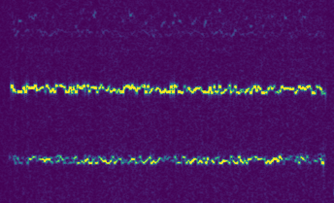

# WSPR

_This page is a collection of notes and resources related to WSPR transmission and reception._

**[WSPR](https://en.wikipedia.org/wiki/WSPR_(amateur_radio_software)) is a digital radio communication protocol designed for weak signal transmission**. WSPR uses [frequency-shift keying](https://en.wikipedia.org/wiki/Frequency-shift_keying) and [forward error correction](https://en.wikipedia.org/wiki/Forward_error_correction) to reliably send data tens or thousands of miles with just a few milliwatts of power. WSPR encoding and decoding underlying [WSJT-X](https://physics.princeton.edu/pulsar/K1JT/wsjtx.html) is open-source, but implemented in C and FORTRAN.

<dev align="center">



</dev>

## Anatomy of a WSPR Transmission

A WSPR transmission sounds like an audible tone that shifts frequency slightly a couple times per second for about two minutes. More specifically, this is what it's transmitting:

* 110.6 sec continuous wave
* Frequency shifts among 4 tones every 0.683 sec
* Tones are separated by 1.46 Hz
* Total bandwidth is about 6 Hz
* 50 bits of information are packaged into a 162 bit message with FEC
* Transmissions always begin 1 sec after even minutes (UTC)

## WSPR Spectrogram

Let's take a look at the original size of the spectrogram capture of the WSPR transmission captured in the screenshot above:


* Sample Rate: 48 kHz
* FFT Size: 2^16 samples (1.365 sec)
* FFT Step: 1/8 FFT Size (0.171 sec) (1/4 tone duration)
* FFT Resolution: 0.366 Hz / pixel (1/4 tone separation)

## WSPR Protocol Specification

### Standard Message Format

The standard message is `callsign` + `4 digit locator` + `dBm transmit power`.

```
K1ABC FN20 37
```

This example represents a signal from `K1ABC` (grid `FN20`) sending `10^3.7 mW` (~5 W). 

### Two-Message Format

Messages with a compound callsign and/or 6 digit locator use a two-transmission sequence. 

The first transmission carries `callsign + callsign + power` or `callsign + locator + power`

The second transmission carries `Hashed callsign + locator + power`

### Add-on Prefixes and Suffixes

Add-on prefixes can be up to three alphanumeric characters.
Add-on suffixes can be a single letter or one or two digits.

### Standard Messages Contain 50 Bits

* 28 bits for callsign
* 15 bits for locator
* 7 bits for power level

### Forward Error Correction (FEC)

non-recursive convolutional code with constraint length K = 32, rate r = ​1⁄2.

### Symbols

There are 162 (`(50 + K − 1) * 2`) possible symbols.

Each conveys one sync bit (LSB) and one data bit (MSB).

### Data Transmission Rate and Duration

Keying rate is ​12000⁄8192 = 1.4648 baud

Duration is 162 * ​8192⁄12000 = 110.6 sec

### Modulation

Continuous phase 4 FSK, with 1.4648 Hz tone separation

### Bandwidth

Occupied bandwidth is about 6 Hz

### Synchronization

Synchronization is via a 162 bit pseudo-random sync vector.

Transmissions nominally start one second into an even UTC minute
(e.g., at hh:00:01, hh:02:01, etc.)

### Signal to Noise Ratio

Minimum S/N for reception is around `–34 dB` on the WSJT scale (2500 Hz reference bandwidth)

## The WSPR Coding Process 

> This section was written by Andy Talbot (G4JNT) in 2009 and was translated into Markdown by Scott Harden (AJ4VD) in 2020. It is available in its original form in [this](doc/WSPR_Coding_Process.pdf) PDF.

### Introduction

I wanted a simple way of generating the symbols for programming into a WSPR beacon source consisting of a PIC microcontroller and DDS frequency generator. Whilst Joe, K1JT, has written a facility into the command-line software, WSPR.EXE, to give a listing of the symbols, further processing is needed to extract the values into a useable form. I had written a programme for converting this list to a form suitable for import to PIC assembler file, but the process was messy and time consuming. (Ref 1) I also felt uncomfortable not knowing how the data was generated. 

The solution was to write my own software to generate the WSPR symbols from first principles. (As I have an almost paranoid obsession with not using any data mode before I intimately know its structure and coding, this task would fulfil the necessary learning requirement…) 

Searching the web did not reveal any simple description of the encoding protocol, but did throw up the original source code for the complete WSJT software (in Fortran and C) which was too complex to wade through. Also found were a couple of compilations by other writers, in both Python (Ref 2) and C, for generating the WSPR symbols based on this original source material. 

### Implementation

By studying and modifying the C code (and in the process having to learn and getting to quite like the C language) I managed to write software that generates a .INC file for direct importation into PIC microcontroller code of the WSPR symbols for any given source message. 

Programmes in both C (derived from the original listing ) and PowerBASIC were produced, and checked to ensure they both gave identical results, and agreed with data generated from the original WSPR.EXE software. After all that, here is my description, in non language-specific terms, of WSPR encoding to assist others in understanding the complex encoding process. 

### Input data

1. Callsign with a maximum of six characters consisting only of A-Z, 0-9 and [space]

2. Four digit locator (such as IO90)

3. Power level representing dBm from 0 to 60. All letters are converted upper case 

### Callsign

The third character MUST be a number. To cope with callsigns that start letter followed by a number, a space is appended to the front if necessary. So, for example, `G4JNT` will become `[sp]G4JNT` whereas `GD4JNT` stays as-is. 

Short callsigns are then further padded out to six characters by appending spaces to the end. 

The 37 allowed characters are allocated values from 0 to 36 such that ‘0’ – ‘9’ give 0 – 9, ‘A’ to ‘Z’ give 10 to 35 and [space] is given the value 36. 

Further coding rules on callsigns mean that the final three characters (of the now padded out callsign) can only be letters or [sp] so will only take the values 10 – 36. 

With the characters, designated [Ch X], taking on values from 0 to 36 as defined, the callsign is now compressed into a single integer `N` by successively building up. 

```
N1 = [Ch 1] The first character can take on any of the 37 values including [sp],
N2 = N1 * 36 + [Ch 2] but the second character cannot then be a space so can have 36 values
N3 = N2 * 10 + [Ch 3] The third character must always be a number, so only 10 values are possible.
N4 = 27 * N3 + [Ch 4] – 10]
N5 = 27 * N4 + [Ch 5] – 10] Characters at the end cannot be numbers,
N6 = 27 * N5 + [Ch 6] – 10] so only 27 values are possible.
(In practice N will just be one 32 bit integer variable that can be built up in stages) 
```

Giving an absolute maximum value for `N` of:

```
37 * 36 * 10 * 27 * 27 * 27 = 262177560
```

Which is just comfortably less than `228 = 268435456` and means the callsign can be represented by 28 bits with a range of codes left over for the future, eg. For allocation to special cases and flags. 

### Locator

Designating the four locator characters as `[Loc 1]` to `[Loc 4]`, the first two can each take on the 18 values `A` to `R` only so are allocated numbers from 0 – 17. The second pair can take only the values 0 – 9.

Another integer `M1` is formed from:
```
M1 = (179 - 10 * [Loc 1] - [Loc 3] ) * 180 + 10 * [Loc 2] + [Loc 4]
```

Which gives a range of values from `AA00` (32220) to `RR99` (179), which comfortably fit into a 15 bit representation (215 = 32768), leaving spare codes for further enhancements. 

### Power Level

Power level, `[Pwr]` is taken as a value from 0 – 60. Although only certain values will work with the WSJT / WSPR software (just those ending in 0, 3 or 7) any of the possible 61 values will be encoded; Illegal values are labelled when decoded. 

Power is encoded into `M` by :
```
M = M1 * 128 + [Pwr] + 64
```
Which gives a final range of values for M up to a maximum of 4124287, and fits into 22 bits (222 = 4194304)

### Bit Packing

The total source data has now been reduced to 50 bits of data: 28 for the callsign in `N`, and 15 for the locator and 7 for the power in `M`. _A few special cases of coding are available for future enhancements like text messages, but these are not be covered here._

The two integers `N` and `M` are truncated and combined so the 50 bits sit end-to-end as callsign-locator-power. These are placed into an array of eleven 8-bit bytes `c[0]` to `c[10]`, so the first element `c[0]` contains the most significant 8 bits part of the callsign, `c[1]` the next 8 bits and so on. 

Note that `c[3]` contains both the 4 LSBs of the callsign and 4 MSBs of the locator, and that `c[6]` contains just the two LSBs of M occupying the most significant bit positions. 

The lowest six bits of `c[6]` are set to 0, with the remaining bytearray elements `[c7]` to `c[10]` set to zero. Only the left-most 81 of these 88 total bits are subsequently used. 

_An alternative view is to imagine them as an 81 character-long string containing characters `0` and `1` only._

### Convolutional Encoding / Forward Error Correction

The data is now expanded to add Forward Error Correction (FEC) with a rate ½, constraint length 32, convolutional encoder.  The 81 bits (including the 31 trailing zeros) are read out MSB first in the order:

```
c[0] MSB ... c[0] LSB., c[1] MSB ... c[1] LSB ... etc ... c[11]
```

(or adopting the alternative view, one-at-a-time from the left hand end of the string)

The bits are clocked simultaneously into the right hand side, or least significant position, of two 32 bit shift registers `[Reg 0]` and `[Reg 1]`. Each shift register feeds an ExclusiveOR parity generator from feedback taps described respectively by the 32 bit values `0xF2D05351` and `0xE4613C47`. 

Parity generation starts immediately the first bit appears in the registers (which must be initially cleared) and continues until the registers are flushed by the final 31st zero being clocked into them.

Each of the 81 bits shifted in generates a parity bit from each of the generators , a total of 162 bits in all. For each bit shifted in, the resulting two parity bits are taken in turn, in the order the two feedback tap positions values are given, to give a stream of 162 output bits. 

### Parity Generation Process Summary

The expansion from 50 source data bits to 162 has added sufficient redundancy in an optimised manner to give a code capable of very strong Forward Error Correction against random errors. 

* Shift the next source bit into the LSB of `[Reg 0]` and `[Reg 1]` (existing bits shift left)
* Take the contents of `[Reg 0]`
* `AND` with `0xF2D05351`
* Calculate the single bit parity (`XOR`) of the resulting sum
* Append to the output data stream
* Take the contents of `[Reg 1]`
* `AND` with `0xE4613C47`
* Calculate the single bit parity (`XOR`) of the resulting sum
* Append to the output data stream 

### Interleaving

Errors over a radio link are rarely random, being more likely to occur in bursts against which this sort of convolutional coding is less effective. The final stage of encoding is to mix up, or interleave the 162 data bits so as to move adjacent bits away from each other in time. The result is that close-together bits corrupted by burst interference are spread throughout the frame and therefore appear as random errors – which the FEC process can cope with.

The interleaving process is performed by taking the block of 162 starting bits labelled `S[0]` to `S[161]` and using a bit reversal of the address to reorder them, to give a pattern of destination bits referred to as `D[0]` to `D[161]`. 

* Initialise counter `P` to `0`
* Take each 8-bit address from `0` to `255`, referred to here as I Bit-reverse `I` to give a value `J`. For example: `I = 1` gives `J = 128`, `I = 13` gives `J = 176`, etc.
  * If the bit-reversed `J` yields a value less than 162 then: set Destination bit `D[J]` = source bit `S[P]`
  * Increment `P`
* Stop when `P = 162`

This completely shuffles and reorders the 162 bits on a one-to-one basis. 

### Merge With Sync Vector

The 162 bits of data are now merged with 162 bits of a pseudo random synchronization word having good auto-correlation properties. Each source bit is combined with a sync bit taken in turn from the table below to give a four-state symbol value: 

`Symbol[n] = Sync[n] + 2 * Data[n]`

Resulting in 162 sequential symbols each with a value from 0 to 3:

```
162 bit Synchronization Vector
1,1,0,0,0,0,0,0,1,0,0,0,1,1,1,0,0,0,1,0,0,1,0,1,1,1,1,0,0,0,0,0,0,0,1,0,0,1,0,1,0,0
0,0,0,0,1,0,1,1,0,0,1,1,0,1,0,0,0,1,1,0,1,0,0,0,0,1,1,0,1,0,1,0,1,0,1,0,0,1,0,0,1,0
1,1,0,0,0,1,1,0,1,0,1,0,0,0,1,0,0,0,0,0,1,0,0,1,0,0,1,1,1,0,1,1,0,0,1,1,0,1,0,0,0,1
1,1,0,0,0,0,0,1,0,1,0,0,1,1,0,0,0,0,0,0,0,1,1,0,1,0,1,1,0,0,0,1,1,0.0,0 
```

### Modulation

Each symbol represents a frequency shift of `12000 / 8192 Hz` (`1.46Hz`) per symbol value giving four-level multi-FSK modulation. The transmitted symbol length is the reciprocal of the tone spacing, or approximately `0.683` seconds, so the complete message of 162 symbols takes around `110.6` seconds to send and occupies a bandwidth of approximately `6Hz`.

### Packing for export and storage
For export, the 162 two-bit symbols are packed four to a byte, MSB first, into 41 locations. 

## Resources
* [WSPR](https://en.wikipedia.org/wiki/WSPR_(amateur_radio_software)) on Wikipedia
* [K1JT Program](http://physics.princeton.edu/pulsar/K1JT/devel.html)
* [Grid square lookup](http://www.levinecentral.com/ham/grid_square.php?Grid=FN20)
* [WSJT](https://sourceforge.net/projects/wsjt/) on SourceForge
* [WSPR Mode in WSJT-X](https://wsprnet.org/drupal/node/5563)
